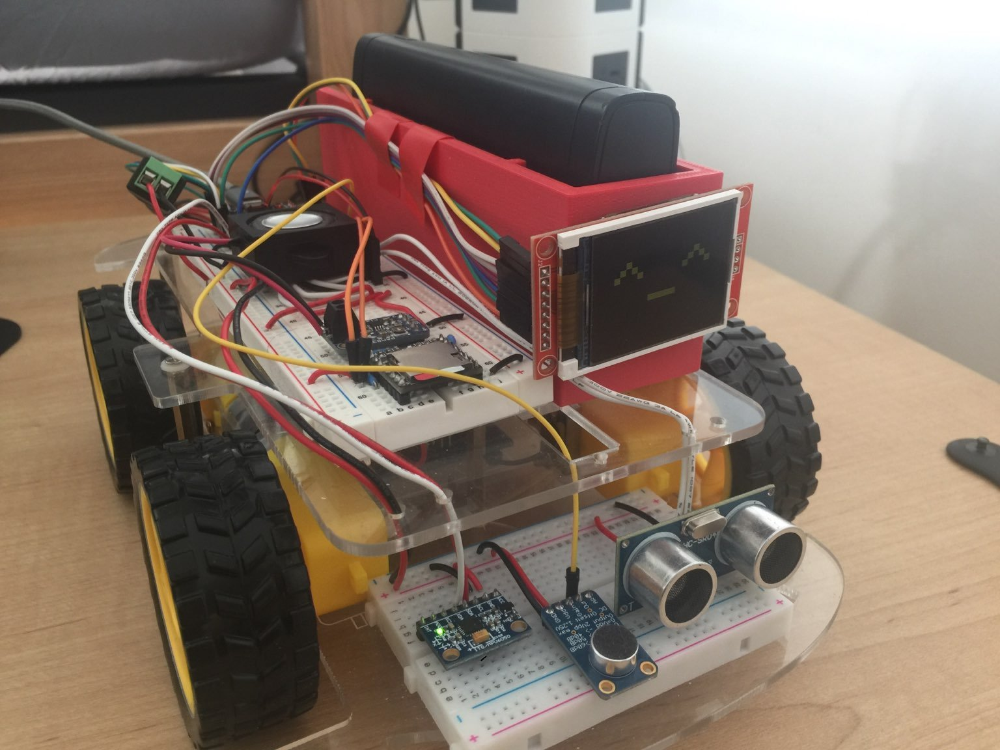

# robot-car
A repo with various control schemes for a simple robotic car.

## random-and-emote
A mode that uses randomly generated actions/movements and basic obstacle avoidance using an ultrasonic sensor. 
Includes emoticons that are updated on an LCD screen.
## manual
A mode that allows for manual control through Bluetooth.
